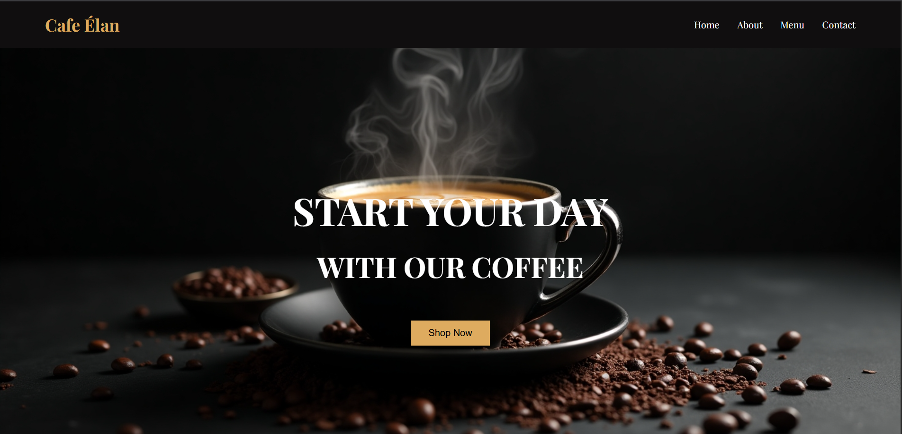

# ☕ Cafe Élan — The Coffee Experience, Refined

Welcome to **Cafe Élan**, a beautifully crafted, modern, and responsive coffee shop landing page. Built using only HTML and CSS, this project blends smooth UI design, scroll animations, parallax effects, and mobile responsiveness — perfect for cafes, restaurants, or creative portfolios.

---

## 🌟 Features

- 🌆 Stunning Hero Section with Parallax
- 📱 Mobile-Friendly Responsive Design
- 🧋 Modern Menu Cards with Hover Effects
- 📩 Working Contact Form UI
- 🎯 Smooth Scroll and Animated Interactions
- 🍩 Clean code, pure HTML + CSS

---

## 🚀 Live Demo

👉 [cafe-elan.netlify.app](#) 

---

## 📷 Preview

---

## 📄 License

This project is licensed under the **MIT License** — free to use and modify. Just give credit! ❤️

---

## 🤝 Let's Connect

Like the project? Star it ⭐ — or reach out to collaborate!

- Instagram: [@alensharhan](https://instagram.com/alensharhan)

